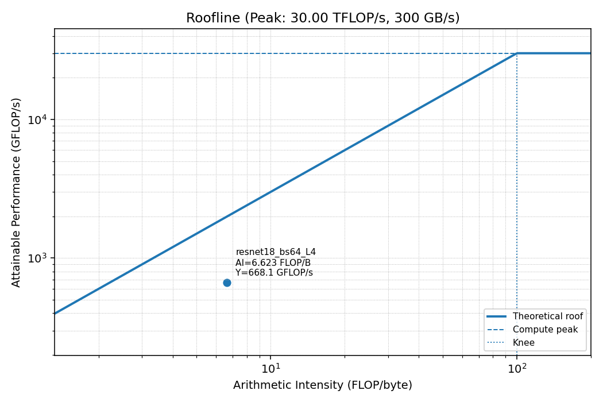

# Performance Analysis of Model Training

* Experiment with performance profilers (NVIDIA Nsight Compute).
* Train ResNet18 and ResNet34 on CIFAR-10.
* Extract `.ncu-rep` file as a csv and generate a roofline model using `plot-roofline.py`. If available, NCU UI can be used for roofline modeling instead.



### Jump To:
- [Model Training](#train)
- [Training Arguments](#training-arguments)
- [Roofline Modeling](#roofline)
- [Directory](#directory)

## <a id="train"></a> 🚂 Train

1. Activate a venv.
```bash!
python3 -m venv .venv
source .venv/bin/activate
python3 -m pip install --upgrade pip
```

2. Install dependencies.

* If on CPU or MPS (Apple Silicon):
```bash!
pip install -r requirements.txt
```

* If on NVIDIA, prefer CUDA wheels:
```bash!
pip install torch torchvision numpy pillow --index-url https://download.pytorch.org/whl/cu121
```

3. Train.

* For CPU or MPS:
```bash!
python3 train.py --model resnet18 --epochs 5 --batch-size 128
```

* On NVIDIA GPUs, enable mixed precision (amp) for speed:
```
python3 train.py --model resnet18 --epochs 20 --batch-size 256 --amp --workers 4
```

## <a id="training-arguments"></a> 🚀 Training Arguments
```bash!
python3 train.py [--epochs <INT>] [--batch-size <INT>] [--lr <FLOAT>] \
                 [--data <PATH>] [--out-dir <DIR>] \
                 [--workers <INT>] [--amp] [--label-smoothing <FLOAT>] \
                 [--warmup <INT>] [--seed <INT>] [--resume <PATH>] \
                 [--save-every <INT>] [--model <STRING>] \
                 [--profile-one-step] [--warmup-iters <INT>] [--profile-iter <INT>]
```

  * `--epochs`: Number of full passes over the training set.
  * `--batch-size`: Mini-batch size per training step.
  * `--lr`: Initial learning rate.
  * `--data`: CIFAR-10 data directory; downloads here if missing.
  * `--out-dir`: Output directory for checkpoints/final weights.
  * `--workers`: Number of DataLoader worker processes (typical: 0–2 on CPU, 4–8 on CUDA).
  * `--amp`: Enable mixed precision on CUDA (ignored on CPU/MPS).
  * `--label-smoothing`: Label smoothing for cross-entropy (e.g., 0.1).
  * `--warmup`: Optimizer steps (not epochs) of linear warmup before cosine decay.
  * `--seed`: RNG seed.
  * `--resume`: Resume from checkpoint produced by this script.
  * `--save-every`: Save a snapshot every N epochs (0 disables).
  * `--model`: specify model, either `resnet18` or `resnet34`.
  
  ### NVTX
  NVTX is NVIDIA’s API for adding named ranges/markers to your code so Nsight tools can attribute and filter GPU work by those labeled regions. We can use NVTX to profile one training step (forward + backward + optimizer)
  * `--profile-one-step`: Warm up, then NVTX-mark exactly one training step and exit early.
  * `--warmup-iters`: Iterations to run before profiling (default: 20).
  * `--profile-iter`: Which iteration after warmup to profile (default: 1; i.e., the first post-warmup step).

## <a id="roofline"></a> 📈 Roofline

1. First, generate a `.ncu-rep` file. The metrics listed below must be included.
```bash!
ncu \
  --nvtx \
  --nvtx-include "train_step/" \
  --target-processes all \
  --metrics sm__throughput.avg.pct_of_peak_sustained_elapsed,\
dram__throughput.avg.pct_of_peak_sustained_elapsed,\
gpu__time_duration.sum,\
smsp__sass_thread_inst_executed_op_fadd_pred_on.sum,\
smsp__sass_thread_inst_executed_op_fmul_pred_on.sum,\
smsp__sass_thread_inst_executed_op_ffma_pred_on.sum,\
dram__bytes_read.sum,\
dram__bytes_write.sum \
  --force-overwrite \
  --export report-file-name \
  python3 train.py --epochs 1 --batch-size 128 --profile-one-step --warmup-iters 20
```

2. Export `.ncu-rep` as a csv, and parse it to generate a profiler summary.
```bash!
ncu --import report.ncu-rep --csv > report.csv
python3 parse_ncu_csv.py report.csv --label resnet18_bs128_L4 --out summary.txt
```

3. Based on the summary, generate a roofline model by passing in arguments. `ai` and `gflops` are extracted from `.ncu-rep`, and `peak-compute` and `peak-bw` are known for each GPU (e.g., 30 TFLOPS and 300 GB/s for L4).
```bash!
python3 plot_roofline.py \
  --ai 15.624057 \
  --gflops 1466.556 \
  --peak-compute 30.0 \
  --peak-bw 300.0 \
  --label resnet18_bs128_L4 \
  --out resnet18_bs128_L4.png
```

## <a id="directory"></a> 📁 Directory
```
nn-perf/
├─ train.py
├─ data/
├─ artifacts/
└─ roofline/
```

* `data/` [Not tracked by git]
    * `cifar-10-python.tar.gz`: the original compressed dataset that `torchvision` downloads.
    * `cifar-10-batches-py/`: extracted from the tarball. This is what `torchvision.datasets.CIFAR10` actually reads.
        * `data_batch_1` … `data_batch_5`: 5 training batches - 10,000 images each.
        * `test_batch`: 10,000 test samples.

* `artifacts/` [Empty directory tracked by git]
    * `*_final_weights.pt` (weights only)
        * Use for inference or fine-tuning from scratch LR.
        * Contains just `model.state_dict()`.
    * `*_best.pt` (full checkpoint)
        * Use to resume training with identical optimizer dynamics.
        * Contains model weights, optimizer state (e.g., momentum), scheduler state (e.g., where you are on the LR curve), plus metadata like epoch and best accuracy.

* `roofline/`
    * `parse_ncu_csv.py`: parse `.ncu-rep` and generates a summary text file.
    * `plot_roofline.py`: generates a roofline model and save it as a png.
